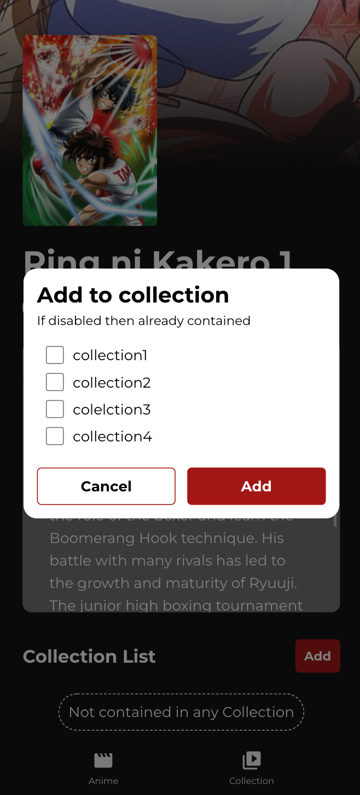

<h1 align="center">
  <br>
  Anime Collection Project
  <br>
  <br>
  <div align="center">
    
  </div>
</h1>


# Description

Web app to display anime with API from anilist \
Web app URL: https://anilist-fauzan.netlify.app

# Tech Stack

* React.js
* Apollo for GQL Client
* Emotion for CSS in JS
* Web Storage APIs
* React Testing Library for Unit and Integration Test

# How to Run
1. Clone or download this repository
2. Open terminal in this project
3. Run this command to install dependencies
```
npm install
```
4. Run this command
```
npm start
```
5. Open [http://localhost:3000](http://localhost:3000) to view it in your browser.
6. To run the unit/integration test, use this command
```
npm test
```

# Features
Use mobile view for better experience, since this web is mobile-first design

## Anime List Page
You can see list of Anime
<div>
  
  
</div>
<br />

You can bulk add anime to the collection
<div>
  
  
</div>
<br />

## Anime Detail Page
You can see the anime detail info by clicking one of the anime card from the list page \
From this page you can also see whether the anime is contained in collections or not
<div>
  
</div>
<br/>

You can add anime to collection by clicking add button
<div>
  
</div>
<br/>

## Collection List Page
You can see all of the collection on this page
<div>
  
</div>
<br/>

You can remove collection by clicking on the trash icon on the collection card
<div>
  
</div>
<br/>

You can add collection by clicking the + button
<div>
  
</div>
<br/>

You can edit collection by clicking on the pencil icon on the collection card
<div>
  
</div>
<br/>

## Collection Detail Page
You can see list of anime that already added to the collection
<div>
  
</div>
<br/>

You can remove anime from this collection by clicking x button on the anime card
<div>
  
</div>
<br/>

You can edit collection by clicking the edit collection button
<div>
  
</div>
<br/>

## Notes
All features successfully implemented

### Author
```
Muhammad Fauzan Al-Ghifari
```


